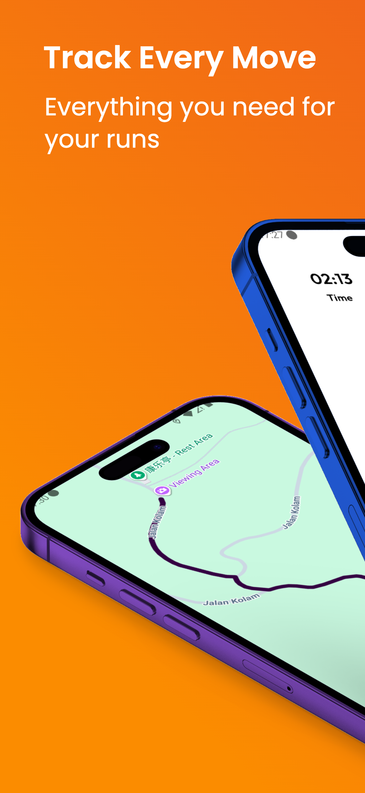
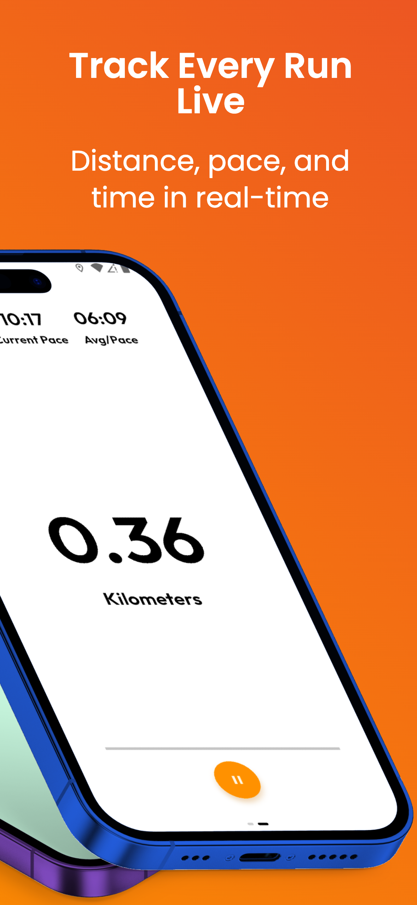
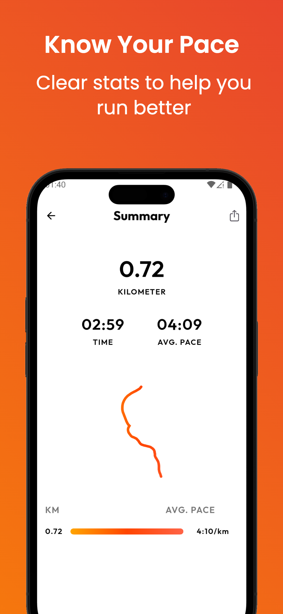
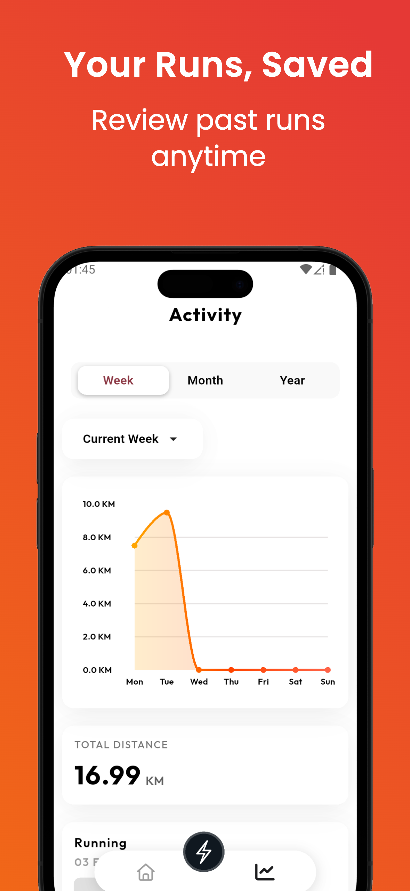
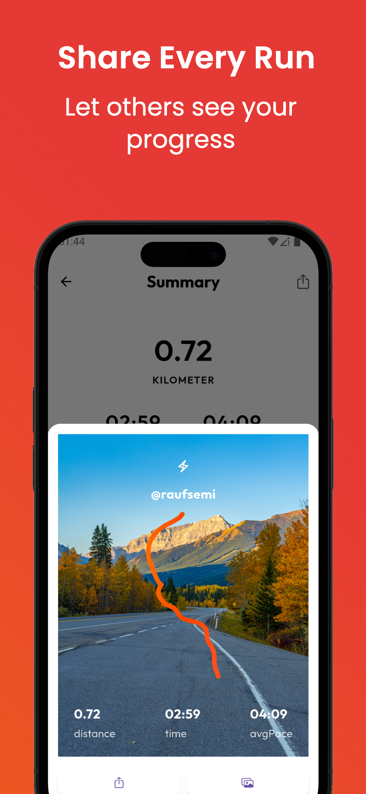

# BYWAY FIT 🏃‍♂️ 💪

A mobile fitness app that helps you **track, monitor, and visualize your activities**. Whether you run, cycle, briskwalk or hike, **Byway Fit** keeps you motivated with **real-time metrics, history, and personalized insights**.  

---

## 🌟 Key Features

- Track running, cycling, hiking, and more  
- Real-time metrics: distance, pace, speed, and time  
- Detailed activity history and analytics  
- Notifications and reminders to hit your goals  
- Profile management for preferences and targets  

---

## 📱 Screenshots

  
  
  
  
  

---

## 📬 Contact

For support or feedback:  **https://t.me/bywayfit**